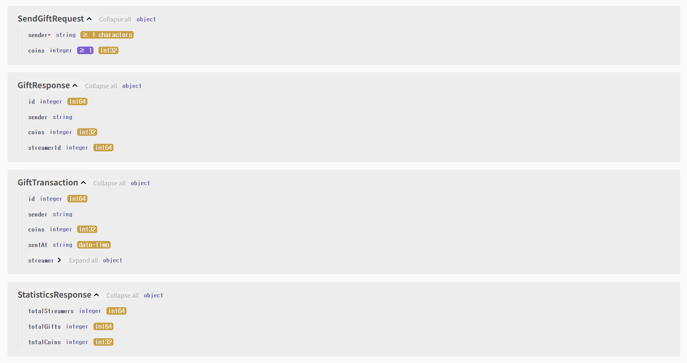

# Live Gifting Backend

A backend REST API project built with **Spring Boot**, **PostgreSQL**, and **Docker**, inspired by the gifting system used in live streaming platforms such as TikTok LIVE.

The project demonstrates modern backend development practices including layered architecture, DTO-based API design, exception handling, database persistence, and containerized deployment.

---

# Project Overview

This application simulates a live gifting platform where users can create streamers, send virtual gifts, track gift transactions, and retrieve platform statistics through REST APIs.

The primary goal of this project is to showcase backend engineering skills commonly used in production systems, including:

* RESTful API development
* Layered architecture (Controller → Service → Repository)
* Spring Data JPA and PostgreSQL integration
* DTO-based request and response models
* Global exception handling
* Docker containerization
* OpenAPI / Swagger documentation

---

# Tech Stack

* Java 21
* Spring Boot
* Spring Data JPA
* PostgreSQL
* Docker
* Maven
* REST API
* Swagger / OpenAPI

---

# Architecture

```text
                +----------------+
                |     Client     |
                +----------------+
                         |
                         v
                +----------------+
                |   Controller    |
                +----------------+
                         |
                         v
                +----------------+
                |    Service      |
                +----------------+
                         |
                         v
                +----------------+
                |   Repository    |
                +----------------+
                         |
                         v
                +----------------+
                |   PostgreSQL    |
                +----------------+
```

---

# Key Features

* Create and manage streamers
* Send virtual gifts to streamers
* Retrieve streamer leaderboards
* Store and query gift transaction history
* Generate overall platform statistics
* Layered backend architecture for maintainability
* DTO-based API contracts
* Centralized global exception handling
* PostgreSQL persistence using Spring Data JPA
* Dockerized application deployment
* Interactive API testing through Swagger UI

---

# API Endpoints

| Method | Endpoint                        | Description                                 |
| ------ | ------------------------------- | ------------------------------------------- |
| GET    | `/streamers`                    | Retrieve all streamers                      |
| POST   | `/streamers`                    | Create a new streamer                       |
| GET    | `/streamers/{id}`               | Retrieve streamer details                   |
| GET    | `/streamers/leaderboard`        | Retrieve leaderboard                        |
| GET    | `/gifts`                        | Retrieve available gifts                    |
| POST   | `/gifts/streamers/{streamerId}` | Send a gift                                 |
| GET    | `/gifts/streamers/{streamerId}` | Retrieve gifts received by a streamer       |
| GET    | `/transactions`                 | Retrieve all gift transactions              |
| GET    | `/streamers/{id}/history`       | Retrieve transaction history for a streamer |
| GET    | `/statistics`                   | Retrieve platform statistics                |

---

# Swagger Documentation

After starting the application, interactive API documentation is available at:

```
http://localhost:8080/swagger-ui/index.html
```

You may optionally include a screenshot below.

```
docs/swagger.png
```

---

# Running the Project

## Prerequisites

* Java 21
* Maven
* PostgreSQL
* Docker (optional)

---

## Local Setup

Create a PostgreSQL database:

```
live_gifting_db
```

Configure `application.properties`:

```properties
spring.datasource.url=jdbc:postgresql://localhost:5432/live_gifting_db
spring.datasource.username=postgres
spring.datasource.password=YOUR_PASSWORD
```

Run the application:

```bash
./mvnw spring-boot:run
```

---

## Docker Setup

Build the Docker image:

```bash
docker build -t live-gifting-backend .
```

Run the container:

```bash
docker run -p 8080:8080 live-gifting-backend
```

---

# Future Improvements

* JWT-based authentication and authorization
* Redis caching for frequently accessed data
* Comprehensive unit and integration testing
* GitHub Actions CI/CD pipeline
* Cloud deployment (AWS, Azure, or GCP)
* Monitoring and logging support
* Rate limiting and API security enhancements

---

# Learning Outcomes

This project strengthened practical experience in:

* Designing RESTful APIs
* Implementing layered backend architecture
* Working with relational databases using Spring Data JPA
* Building maintainable service-oriented code
* Managing data persistence with PostgreSQL
* Containerizing backend services with Docker
* Using Git and GitHub for version control and collaboration

---

# Author

**Seoyeon Lee**

Backend engineering practice project developed as part of personal portfolio preparation for software engineering internship applications.

## API Documentation (Swagger)

The project includes OpenAPI documentation powered by Swagger UI.

